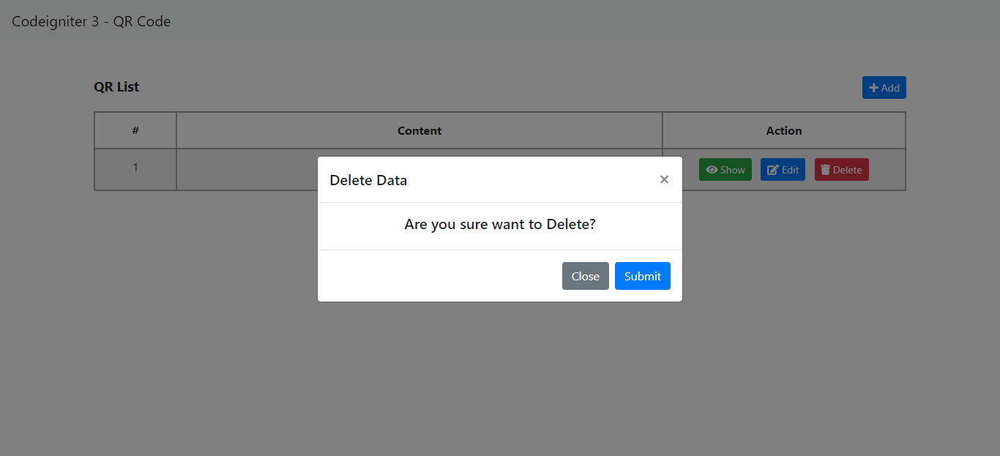

# Notice

This repository is a sample of [Codeigniter 3 - QR Code](https://github.com/kenjis/codeigniter3-qrcode) upgraded to CodeIgniter4 using *[ci3-to-4-upgrade-helper](https://github.com/kenjis/ci3-to-4-upgrade-helper)*.

The Original Codeigniter 3 - QR Code is <https://github.com/chriscelnovian/codeigniter3-qrcode>.

# Codeigniter 4 - QR Code

Codeigniter 4 QR Code Generator


## Description
Kind of sample features :
- Save QR Code Image to Directory and Data to Database
- CRUD Operation




## Resources
- Codeigniter 4.1.2-dev
- CI QR Code 1.0
- Bootstrap 4.6.0
- Font Awesome 5.15.2
- jQuery 3.5.1
- jQuery UI 1.12.1
- Popper 2.6.0

## Installation

### Setup Database

```
$ mysql -uroot
```

```
mysql> CREATE DATABASE `codeigniter3_qrcode` DEFAULT CHARACTER SET utf8mb4;
```

```
$ mysql -uroot codeigniter3_qrcode < 'database/codeigniter3_qrcode.sql'
```

### Configure

```sh-session
$ cp env .env
```

### Run built-in Web Server

```
$ bin/server.sh
```
